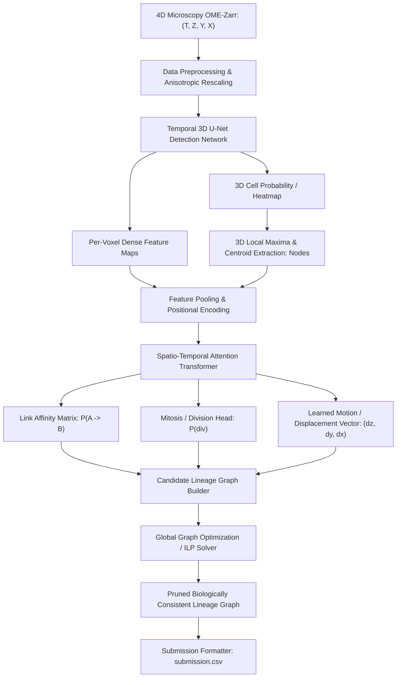

# 🔬 Biohub: Cell Tracking During Development
## Architectural Master Plan & Governance Blueprint

---

## Executive Summary & System Overview

This blueprint establishes the end-to-end engineering specification for the **Biohub — Cell Tracking During Development** Kaggle competition. The objective is to reconstruct complete spatio-temporal cell lineage directed acyclic graphs (DAGs) from high-resolution, anisotropic 4D light-sheet microscopy sequences $(T, Z, Y, X)$.

### System Architecture Pipeline


---

## Section A: Ground Truth Dataset Findings

Following direct inspection of the official competition environment and the reference baseline (`royerlab/kaggle-cell-tracking-competition`):

1. **Physical Dimensions & Anisotropic Spacing**:
   - Voxel spacing is physically anisotropic: $(s_z, s_y, s_x) = (1.625\,\mu\text{m}, 0.40625\,\mu\text{m}, 0.40625\,\mu\text{m})$.
   - Axial ($Z$) resolution is exactly **$4.0\times$ coarser** than lateral ($Y, X$) resolution. Isotropic resampling or explicit anisotropic convolution kernel design is required.
   - Volumes are stored in OME-Zarr format (`group["0"]`), allowing out-of-core chunked slicing without loading entire multi-gigabyte time-series into host RAM.

2. **Sparse Ground Truth Annotations**:
   - Labels are stored in Graph Exchange File Format (`.geff`) via `tracksdata`.
   - **Crucial Ground Truth Reality**: Ground truth is **sparse**. In each video, human annotators followed only a small subset of lineages.
   - **Negative Example Trap**: An unannotated cell in the volume is *not* background. Treating all unannotated coordinates as negatives destroys detector and tracker recall. Training objectives must explicitly mask unannotated rows and columns.

3. **Graph Topology & Mitosis Representation**:
   - **Nodes**: Spatio-temporal coordinates $(t, z, y, x)$ in physical or pixel space.
   - **Temporal Edges**: Directed connections $(u \to v)$ linking cell $u$ at $t$ to cell $v$ at $t+1$.
   - **Cell Divisions (Mitosis)**: Exactly one parent node at $t$ with degree $\text{out-deg}(u) = 2$ targeting two daughter cells at $t+1$. Merging cells ($\text{in-deg} > 1$) is biologically prohibited.

4. **Competition Metric & Scoring Mechanics**:
   - Primary Metric: 
     $$\text{Score} = \text{Adjusted Edge Jaccard} + 0.1 \times \text{Division Jaccard}$$
   - **Spatial Bipartite Node Matching**: Max distance threshold is $7.0\,\mu\text{m}$ in physical space:
     $$\text{dist} = \sqrt{(s_z \cdot \Delta z)^2 + (s_y \cdot \Delta y)^2 + (s_x \cdot \Delta x)^2} \le 7.0\,\mu\text{m}$$
   - **Edge Evaluation**: Only edges whose endpoints fall into the matched GT subgraph are penalized. Unmatched predicted edges outside annotated lineages are ignored.
   - **Spurious Node Penalty**:
     $$\text{Adjusted Jaccard} = \max\left(0, \text{Jaccard} \cdot \left(1 - 0.1 \cdot \frac{T_{\text{pred}} - T_{\text{true}}}{T_{\text{true}}}\right)\right)$$
     where $T_{\text{true}}$ is the coarse total cell estimate (`estimated_number_of_nodes` in `.geff` metadata). Over-detecting hallucinated cells directly degrades the score.

5. **Submission Schema**:
   - Column format: `id,dataset,row_type,node_id,t,z,y,x,source_id,target_id`.
   - Integer coordinates for nodes, `-1` sentinel values for non-applicable row fields.

---

## Section B: Architecture Confirmation

The locked architecture is confirmed with zero extraneous ML libraries (strictly PyTorch, `tracksdata`, Zarr, Polars, SciPy, and ILP formulation):

1. **Detection**: Fully 3D Convolutional U-Net with spatio-temporal self-attention across consecutive frames (`TemporalUNet3D`).
2. **Representation**: 3D feature pooling around detected sub-pixel / integer centroids concatenated with sinusoidal positional embeddings.
3. **Tracking**: Cross-attention Transformer (`SimpleNodeTransformer` extended with Trackastra-inspired temporal windowing) producing transition affinity matrices.
4. **Division**: Explicit division scoring head penalizing false splits and enforcing daughter symmetry.
5. **Global Consistency**: Integer Linear Programming (ILP) via `td.solvers.ILPSolver` enforcing $\text{in-degree} \le 1$ and $\text{out-degree} \le 2$.

---

## Section C: 14-Phase Detailed Implementation Plan

```mermaid
gantt
    title Biohub Implementation Roadmap
    dateFormat  X
    axisFormat  Phase %X
    section Setup & Data
    Phase 0 - Environment & Dataset Verification      :0, 1
    Phase 1 - Data Loading & Preprocessing Engine    :1, 2
    Phase 2 - EDA & Napari Spatial Visualization      :2, 3
    section Detection Core
    Phase 3 - 3D U-Net Detection Baseline            :3, 4
    Phase 4 - Peak Extraction & Detection Metric      :4, 5
    section Tracking & Association
    Phase 5 - Feature Pooling & Embedding Pipeline   :5, 6
    Phase 6 - Spatio-Temporal Transformer Tracking    :6, 7
    Phase 7 - Division Head & Mitosis Reasoning      :7, 8
    section Optimization & Graph
    Phase 8 - Candidate Lineage Graph Construction   :8, 9
    Phase 9 - Global ILP Optimization Engine         :9, 10
    Phase 10 - End-to-End Lineage Assembly           :10, 11
    section Evaluation & Delivery
    Phase 11 - Official Metric Benchmark & Error QA   :11, 12
    Phase 12 - Kaggle Inference Engine & Slicing     :12, 13
    Phase 13 - Submission Generator & Verification    :13, 14
```



---

### Phase 0: Environment & Dataset Verification

- **Goal**: Establish an isolated, reproducible virtual environment and download/verify the full competition dataset and official tools.
- **What We Will Build**: Project root configuration, dependency lock file, dataset download automation script, and environment verification checks.
- **Relevant Theory**: Isolation prevents dependency conflicts. PyTorch $\ge 2.5$ with CUDA 12/13 and `tracksdata` C-extensions require specific Python versions ($3.11 \le \text{Python} < 3.14$).
- **Files/Modules to Create**:
  - `pyproject.toml`
  - `.env.example`
  - `scripts/setup_env.sh`
  - `scripts/download_data.py`
  - `tests/test_env.py`
- **Inputs & Outputs**:
  - Inputs: Kaggle API token or competition data URL.
  - Outputs: Functional Python virtual environment, populated `data/train` and `data/test` containing `.zarr` and `.geff` files.
- **Training Requirements**: None (CPU/setup phase).
- **Validation/Testing Method**: Run `pytest tests/test_env.py` verifying CUDA acceleration, Zarr read access, and `tracksdata` graph import.
- **Expected Result**: Clean environment with verified GPU access (`torch.cuda.is_available() == True`).
- **Dependencies on Previous Phases**: None.
- **Possible Failure Modes**: Kaggle CLI authentication failure; PyTorch/CUDA driver mismatch on local RTX 3050; missing build tools for `tracksdata`.
- **Definition of Done**: Automated test passes confirming all libraries import without warning and sample datasets load.

---

### Phase 1: Data Loading & Preprocessing Engine

- **Goal**: Construct an out-of-core 4D patch streaming loader capable of handling anisotropic voxel dimensions and sparse ground truth annotations.
- **What We Will Build**: `ZarrDataset` and `PatchSampler` supporting random 3D crop extraction, intensity quantile normalization, and coordinate scaling.
- **Relevant Theory**: Light-sheet microscopy exhibits severe light attenuation and photobleaching. Min-max normalization fails due to bright debris. Using 1% and 99.9% intensity quantiles:
  $$I_{\text{norm}} = \text{clip}\left(\frac{I - Q_{0.01}}{Q_{0.999} - Q_{0.01}}, 0, 1\right)^{\gamma}$$
- **Files/Modules to Create**:
  - `src/data/zarr_reader.py`
  - `src/data/preprocessing.py`
  - `src/data/patch_sampler.py`
  - `tests/test_data_loader.py`
- **Inputs & Outputs**:
  - Inputs: `*.zarr` directory and paired `*.geff` graph.
  - Outputs: PyTorch tensors $(B, T, C, Z_{\text{patch}}, Y_{\text{patch}}, X_{\text{patch}})$ with corresponding ground truth node coordinates.
- **Training Requirements**: Memory budget $\le 2.5\,\text{GB}$ host RAM per worker.
- **Validation/Testing Method**: Unit test verifying patch extraction matches expected coordinates and tensor values stay in $[0, 1]$.
- **Expected Result**: Deterministic, high-throughput data loader delivering $\ge 10$ batches/sec.
- **Dependencies on Previous Phases**: Phase 0.
- **Possible Failure Modes**: High disk I/O latency on Zarr reads; out-of-bounds spatial patches near volume edges.
- **Definition of Done**: Test suite passes verifying patch tensor shapes, quantile scaling, and bounding box safety.

---

### Phase 2: Exploratory Data Analysis & Spatial Visualization

- **Goal**: Quantify dataset statistics (cell density, velocities, mitosis frequencies, anisotropy) and integrate Napari visual inspection.
- **What We Will Build**: Automated EDA script generating distributions and Napari viewer script displaying 3D volumes overlaid with `.geff` trajectories.
- **Relevant Theory**: Cell displacement between consecutive timepoints follows a Maxwell-Boltzmann or normal distribution:
  $$\Delta \mathbf{r} = \mathbf{x}_{t+1} - \mathbf{x}_t$$
  Quantifying maximum displacement $\max \|\Delta \mathbf{r}\|$ determines the candidate search radius for tracking.
- **Files/Modules to Create**:
  - `src/eda/dataset_stats.py`
  - `src/visualization/napari_viewer.py`
  - `notebooks/01_eda_and_distribution.ipynb`
- **Inputs & Outputs**:
  - Inputs: Raw `.zarr` and `.geff` files.
  - Outputs: Statistical distribution report (`dataset_profile.json`), Napari interactive viewer.
- **Training Requirements**: None.
- **Validation/Testing Method**: Verify computed cell speed statistics match physical developmental literature ($\approx 1\text{--}5\,\mu\text{m/frame}$).
- **Expected Result**: Clear determination of max displacement radius $R_{\max} \approx 15\,\mu\text{m}$ for candidate linking.
- **Dependencies on Previous Phases**: Phase 1.
- **Possible Failure Modes**: Headless server environment crashing Napari Qt GUI (requires fallback export to HTML/TIFF).
- **Definition of Done**: EDA summary produced; Napari viewer renders 4D tracks overlaid on 3D microscopy channels.

---

### Phase 3: 3D U-Net Detection Baseline

- **Goal**: Implement and train a 3D U-Net with temporal self-attention to predict continuous 3D cell probability heatmaps and dense feature representations.
- **What We Will Build**: `TemporalUNet3D` network supporting 3D encoder-decoder stages, residual connections, and temporal cross-slice attention.
- **Relevant Theory**: Cell center heatmaps are generated using 3D Gaussian targets centered at ground truth annotations $\mathbf{\mu} = (z_k, y_k, x_k)$:
  $$G(\mathbf{x}) = \exp\left(-\frac{1}{2} (\mathbf{x} - \mathbf{\mu})^T \mathbf{\Sigma}^{-1} (\mathbf{x} - \mathbf{\mu})\right)$$
  where $\mathbf{\Sigma} = \text{diag}(\sigma_z^2, \sigma_y^2, \sigma_x^2)$ accounts for the $4\times$ anisotropy.
- **Files/Modules to Create**:
  - `src/models/unet3d.py`
  - `src/models/temporal_attention.py`
  - `src/training/losses.py` (Weighted MSE / Soft Dice / Focal Loss)
  - `src/training/train_detector.py`
- **Inputs & Outputs**:
  - Inputs: 4D patch tensor $(B, T, 1, Z, Y, X)$.
  - Outputs: Heatmap tensor $(B, T, 1, Z, Y, X)$ and dense feature tensor $(B, T, C_{\text{feat}}, Z, Y, X)$.
- **Training Requirements**: 4GB VRAM local GPU (utilizing FP16 mixed precision, patch size $(2, 32, 128, 128)$, batch size 2, gradient checkpointing).
- **Validation/Testing Method**: Overfit test on single 5-frame volume (`division_clip`) verifying loss decreases to near zero.
- **Expected Result**: Validation heatmap loss converges; detector distinguishes cell nuclei from background.
- **Dependencies on Previous Phases**: Phase 1.
- **Possible Failure Modes**: CUDA Out of Memory (OOM) on 3D convolutions; gradient explosion in 3D batch normalization.
- **Definition of Done**: `train_detector.py` runs 10 epochs without OOM, demonstrating decreasing validation loss and checkpointing weights.

---

### Phase 4: Cell Detection Extraction & Evaluation

- **Goal**: Extract discrete cell centroid coordinates from predicted continuous heatmaps using 3D non-maximum suppression (NMS) and evaluate detection F1/Recall.
- **What We Will Build**: Local maxima extraction kernel with sub-pixel 3D quadratic interpolation and Hungarian bipartite matching evaluator against sparse GT nodes.
- **Relevant Theory**: Peak extraction uses a 3D maximum filter over window $(k_z, k_y, k_x)$:
  $$\text{Centroid} = \{\mathbf{x} \mid H(\mathbf{x}) = \max_{\mathbf{u} \in \mathcal{N}(\mathbf{x})} H(\mathbf{u}) \text{ and } H(\mathbf{x}) \ge \tau_{\text{det}}\}$$
  Matched against GT within $7.0\,\mu\text{m}$ Euclidean distance.
- **Files/Modules to Create**:
  - `src/detection/peak_detector.py`
  - `src/evaluation/node_matching.py`
  - `tests/test_peak_detector.py`
- **Inputs & Outputs**:
  - Inputs: Predicted heatmap $(T, 1, Z, Y, X)$ and threshold $\tau_{\text{det}}$.
  - Outputs: Array of detected nodes $[(t, z_i, y_i, x_i, \text{score}_i)]$.
- **Training Requirements**: CPU / lightweight inference.
- **Validation/Testing Method**: Compute Node Recall and Precision on validation splits against annotated GT.
- **Expected Result**: Node Recall $\ge 90\%$ within $7.0\,\mu\text{m}$ tolerance threshold.
- **Dependencies on Previous Phases**: Phase 3.
- **Possible Failure Modes**: Clustering of multiple false peaks in large cells; missed dim nuclei; threshold sensitivity causing excessive $T_{\text{pred}}$ penalty.
- **Definition of Done**: Automated unit tests verify synthetic peak recovery; validation pipeline logs precision, recall, and distance residuals.

---

### Phase 5: Cell Feature Extraction & Embedding Pipeline

- **Goal**: Extract localized 3D visual appearance descriptors around detected centroids from the U-Net feature volume, combined with physical positional encodings.
- **What We Will Build**: 3D spatial trilinear interpolation / RoI feature pooling module and sinusoidal spatio-temporal positional encoding generator.
- **Relevant Theory**: For node $i$ at physical coordinate $\mathbf{x}_i = (z_i, y_i, x_i)$, extract feature $\mathbf{f}_i = \text{Pool}(\mathcal{F}, \mathbf{x}_i) \in \mathbb{R}^{C_{\text{feat}}}$ and concatenate sinusoidal Fourier embeddings:
  $$\text{PE}(\mathbf{x}_i) = \left[\sin(2^k \pi \mathbf{x}_i), \cos(2^k \pi \mathbf{x}_i)\right]_{k=0}^K$$
  $$\mathbf{e}_i = \mathbf{W}_p [\mathbf{f}_i \,\|\, \text{PE}(\mathbf{x}_i)] \in \mathbb{R}^{D}$$
- **Files/Modules to Create**:
  - `src/representation/feature_pooling.py`
  - `src/representation/positional_encoder.py`
  - `tests/test_feature_pooling.py`
- **Inputs & Outputs**:
  - Inputs: Feature volume $\mathcal{F}$ and coordinates $[(t, z, y, x)]$.
  - Outputs: Embedding matrix $\mathbf{E}_t \in \mathbb{R}^{N_t \times D}$.
- **Training Requirements**: Integrated into backpropagation graph during end-to-end training.
- **Validation/Testing Method**: Verify gradients flow from node embeddings back into U-Net feature maps.
- **Expected Result**: Differentiable feature extraction producing distinct feature vectors for adjacent cells.
- **Dependencies on Previous Phases**: Phase 3, Phase 4.
- **Possible Failure Modes**: Rounding coordinate errors causing index out-of-bounds; memory spike when node count $N_t$ is high.
- **Definition of Done**: Unit test confirms gradient backpropagation through trilinear feature pooling.

---

### Phase 6: Spatio-Temporal Transformer for Cell Association

- **Goal**: Model temporal cell correspondence across consecutive frames $t \to t+1$ using cross-attention to predict edge transition affinities.
- **What We Will Build**: `SimpleNodeTransformer` (multi-head cross-attention architecture) predicting the pairwise transition matrix $\mathbf{M} \in \mathbb{R}^{N_t \times N_{t+1}}$.
- **Relevant Theory**: For queries $\mathbf{Q} = \mathbf{E}_t \mathbf{W}_Q$ and keys $\mathbf{K} = \mathbf{E}_{t+1} \mathbf{W}_K$:
  $$\mathbf{A} = \text{softmax}_{\text{source}}\left(\frac{\mathbf{Q} \mathbf{K}^T}{\sqrt{D}}\right)$$
  Normalizing across source candidates (dimension 0) enforces that each child at $t+1$ chooses at most one parent, while naturally accommodating cell divisions where two children select the same parent.
- **Files/Modules to Create**:
  - `src/tracking/transformer.py`
  - `src/tracking/cross_attention.py`
  - `src/training/train_tracking.py`
  - `tests/test_transformer.py`
- **Inputs & Outputs**:
  - Inputs: Embeddings $\mathbf{E}_t, \mathbf{E}_{t+1}$ and spatial distance matrix.
  - Outputs: Edge probability matrix $\mathbf{P} \in [0, 1]^{N_t \times N_{t+1}}$.
- **Training Requirements**: 4GB local GPU (pair-wise training on temporal windows $W=2$).
- **Validation/Testing Method**: Sparse focal BCE loss over annotated GT edges:
  $$\mathcal{L}_{\text{edge}} = - (1 - p_t)^\gamma \log(p_t)$$
  masked strictly to annotated rows and columns.
- **Expected Result**: Edge Jaccard $> 0.85$ on validation sets for detected true nodes.
- **Dependencies on Previous Phases**: Phase 5.
- **Possible Failure Modes**: Sparse supervision collapse (predicting zero everywhere because non-annotated cells dominate loss); attention matrix $O(N_t \cdot N_{t+1})$ memory explosion in dense clusters (mitigated by spatial distance gating).
- **Definition of Done**: Model successfully trains with sparse target masking and outputs valid transition probabilities.

---

### Phase 7: Mitosis & Division Reasoning Head

- **Goal**: Formulate an explicit division classification head to accurately identify mitotic splitting events and penalize invalid branching.
- **What We Will Build**: Multi-task division prediction head classifying whether a cell at time $t$ divides into two daughter cells at $t+1$.
- **Relevant Theory**: Mitosis involves distinctive morphological transformation (spherical condensation followed by cleavage furrow formation) and spatial daughter symmetry:
  $$\Delta \mathbf{x}_1 = \mathbf{x}_{\text{child1}} - \mathbf{x}_{\text{parent}}, \quad \Delta \mathbf{x}_2 = \mathbf{x}_{\text{child2}} - \mathbf{x}_{\text{parent}}$$
  Children should move in approximately opposite directions: $\cos(\Delta \mathbf{x}_1, \Delta \mathbf{x}_2) < 0$.
- **Files/Modules to Create**:
  - `src/tracking/division_head.py`
  - `src/tracking/motion_head.py`
  - `tests/test_division_head.py`
- **Inputs & Outputs**:
  - Inputs: Node embeddings $\mathbf{E}_t$ and candidate pair embeddings.
  - Outputs: Division probability $P_{\text{div}}(u) \in [0, 1]$ and 3D motion displacement vectors $(\Delta z, \Delta y, \Delta x)$.
- **Training Requirements**: Weighted classification loss to handle extreme class imbalance (divisions represent $< 2\%$ of transitions).
- **Validation/Testing Method**: Division recall and precision evaluated on ground truth division annotations.
- **Expected Result**: Distinct division scores separating dividing cells from migrating cells.
- **Dependencies on Previous Phases**: Phase 6.
- **Possible Failure Modes**: Severe false positive divisions triggered by high cell density and crossing trajectories.
- **Definition of Done**: Multi-task model outputs link probabilities and division scores simultaneously.

---

### Phase 8: Candidate Lineage Graph Construction

- **Goal**: Construct a directed spatio-temporal candidate graph connecting detected cell nodes across time with edge weights and division metadata.
- **What We Will Build**: `CandidateGraphBuilder` translating predictions into `tracksdata.graph.InMemoryGraph` structures with edge distance pruning.
- **Relevant Theory**: The candidate graph is a directed acyclic graph $G = (V, E)$ where edges only exist forward in time:
  $$e = (u, v) \implies t(v) = t(u) + 1 \quad \text{and} \quad \|\mathbf{x}_v - \mathbf{x}_u\|_{\text{physical}} \le R_{\max}$$
- **Files/Modules to Create**:
  - `src/graph/candidate_graph.py`
  - `src/graph/graph_utils.py`
  - `tests/test_candidate_graph.py`
- **Inputs & Outputs**:
  - Inputs: Detected nodes and scored edge matrices across all frames $0 \le t < T$.
  - Outputs: `tracksdata` compatible candidate graph with attributes (`edge_prob`, `edge_dist`).
- **Training Requirements**: CPU-only graph data structure operations.
- **Validation/Testing Method**: Unit test checking topological acyclicity and boundary conditions.
- **Expected Result**: Clean candidate graph with bounded degree ready for global optimization.
- **Dependencies on Previous Phases**: Phase 6, Phase 7.
- **Possible Failure Modes**: Memory overhead from retaining too many low-probability candidate edges ($> 10^6$ edges per volume).
- **Definition of Done**: Candidate graph builds in under 5 seconds per video, filtering edges below threshold $\tau_{\text{edge}} = 0.05$.

---

### Phase 9: Global Graph Optimization & ILP Engine

- **Goal**: Resolve conflicting local edge predictions into a globally consistent, biologically valid cell lineage graph using Integer Linear Programming (ILP).
- **What We Will Build**: Optimization module wrapping `td.solvers.ILPSolver` with biological conservation constraints.
- **Relevant Theory**: Formulate tracking as maximum-a-posteriori (MAP) integer linear optimization:
  $$\max_{\mathbf{x}, \mathbf{y}, \mathbf{z}} \sum_{e \in E} w_e x_e - \sum_{u \in V} c_{\text{app}} y_u - \sum_{u \in V} c_{\text{dis}} z_u + \sum_{u \in V} c_{\text{div}} d_u$$
  Subject to biological conservation:
  $$\sum_{e \in \delta^-(v)} x_e + y_v = 1 \quad (\text{at most 1 parent})$$
  $$\sum_{e \in \delta^+(u)} x_e - z_u - d_u \le 1 \quad (\text{at most 2 children if dividing, else 1})$$
  $$x_e, y_u, z_u, d_u \in \{0, 1\}$$
- **Files/Modules to Create**:
  - `src/optimization/ilp_solver.py`
  - `src/optimization/constraints.py`
  - `tests/test_ilp_solver.py`
- **Inputs & Outputs**:
  - Inputs: Overcomplete candidate `InMemoryGraph`.
  - Outputs: Pruned optimal subgraph where all biological invariants are satisfied.
- **Training Requirements**: ILP solver (HiGHS / CBC / SCIP backend via `tracksdata`).
- **Validation/Testing Method**: Verify on synthetic graphs containing deliberate conflicts (e.g. 2 parents claiming same child; 3 children claiming 1 parent).
- **Expected Result**: 100% resolution of topological conflicts; exact enforcement of lineage tree constraints.
- **Dependencies on Previous Phases**: Phase 8.
- **Possible Failure Modes**: ILP solver timing out on excessively dense candidate graphs (mitigated by greedy pre-filtering or spatial sub-volume decomposition).
- **Definition of Done**: Solver executes in $< 30$ seconds per full volume and yields zero conservation violations.

---

### Phase 10: End-to-End Lineage Reconstruction

- **Goal**: Wire the entire pipeline from raw 4D Zarr image to final optimized `.geff` track graph without intermediate manual steps.
- **What We Will Build**: `LineageReconstructor` pipeline coordinating chunked 3D U-Net inference, peak extraction, Transformer scoring, candidate graph generation, and ILP solving.
- **Relevant Theory**: Sliding temporal window inference ensures boundary smoothness across time. A temporal window of size $W \ge 2$ processes overlapping frame pairs and aggregates edge probabilities.
- **Files/Modules to Create**:
  - `src/pipeline/reconstruct_lineage.py`
  - `predict.py`
  - `tests/test_end_to_end_pipeline.py`
- **Inputs & Outputs**:
  - Inputs: Path to raw `{dataset}.zarr`.
  - Outputs: Serialized `{dataset}.geff` file containing complete predicted lineage.
- **Training Requirements**: Evaluates trained model checkpoints.
- **Validation/Testing Method**: Run end-to-end reconstruction on `division_clip` fixture and assert clean serialization.
- **Expected Result**: Single-command execution transforming raw voxels into a complete valid tracking graph.
- **Dependencies on Previous Phases**: Phases 1, 3, 4, 6, 7, 8, 9.
- **Possible Failure Modes**: Accumulation of latency across frames; disk write bottlenecks.
- **Definition of Done**: Automated integration test executes pipeline from Zarr to `.geff` without manual intervention.

---

### Phase 11: Competition Metric Evaluation & Error QA

- **Goal**: Implement the exact official competition evaluation protocol (Adjusted Edge Jaccard + Division Jaccard) and conduct visual failure analysis.
- **What We Will Build**: Standalone evaluation suite wrapping `tracking_cellmot.metrics` and error diagnosis tools categorizing false positives and false negatives.
- **Relevant Theory**: Official competition score:
  $$\text{Adjusted Edge Jaccard} = \sum_{i} \frac{N_i}{N_{\text{total}}} \cdot \max\left(0, \text{Jaccard}_i \left(1 - 0.1 \frac{T_{\text{pred}, i} - T_{\text{true}, i}}{T_{\text{true}, i}}\right)\right)$$
  $$\text{Final Score} = \text{Adjusted Edge Jaccard} + 0.1 \times \text{Division Jaccard}_{\text{micro}}$$
- **Files/Modules to Create**:
  - `src/evaluation/official_metric.py`
  - `src/evaluation/error_analysis.py`
  - `evaluate.py`
  - `tests/test_metric_conformance.py`
- **Inputs & Outputs**:
  - Inputs: Directory of predicted `.geff` files and directory of ground truth `.geff` files.
  - Outputs: Summary score report, breakdown of TP/FP/FN edge and division counts, error attribution plots.
- **Training Requirements**: None.
- **Validation/Testing Method**: Run evaluation on sandbox fixtures in `reference/kaggle-cell-tracking-competition/tests/assets/sandbox_examples` and verify scores match ground truth.
- **Expected Result**: 100% numerical parity with the official evaluation scripts.
- **Dependencies on Previous Phases**: Phase 10.
- **Possible Failure Modes**: Mismatch in coordinate round-tripping; differing scale definitions; division bipartite matching discrepancies.
- **Definition of Done**: Conformance test suite passes with zero deviation from official metrics.

---

### Phase 12: Kaggle Inference Engine & Slicing

- **Goal**: Package model weights, graph solvers, and inference scripts into a standalone Kaggle notebook submission pipeline conforming to Kaggle hardware and execution limits.
- **What We Will Build**: Standalone inference runner operating within 9 hours without internet access, utilizing FP16 and spatial tiling.
- **Relevant Theory**: In Kaggle test environments, memory is constrained to 16GB GPU VRAM and 30GB host RAM. Full volumes must be processed using overlapping 3D spatial tiles $(Z_{\text{tile}}, Y_{\text{tile}}, X_{\text{tile}})$ with linear blending along seams.
- **Files/Modules to Create**:
  - `src/inference/kaggle_runner.py`
  - `src/inference/tiler.py`
  - `notebooks/kaggle_submission_template.ipynb`
- **Inputs & Outputs**:
  - Inputs: Kaggle test volume mount (`/kaggle/input/.../test/*.zarr`).
  - Outputs: Directory of predicted `.geff` files in `/kaggle/working/predictions`.
- **Training Requirements**: Offline inference optimization (TorchScript / ONNX / `torch.compile` where applicable).
- **Validation/Testing Method**: Dry-run on local machine simulating test directory structures and strict memory ceilings.
- **Expected Result**: Reliable execution processing 1 full test timepoint in $< 60$ seconds.
- **Dependencies on Previous Phases**: Phase 10, Phase 11.
- **Possible Failure Modes**: Kaggle kernel timeout ($> 9$ hours); running out of `/kaggle/working` disk space.
- **Definition of Done**: Notebook successfully runs end-to-end in headless batch mode without external network access.

---

### Phase 13: Submission Generator & Final Validation

- **Goal**: Convert predicted `.geff` tracking graphs into the official Kaggle `submission.csv` format and perform strict structural schema verification.
- **What We Will Build**: `GeffToCsv` serializer, reverse parser `CsvToGeff`, and submission integrity validator.
- **Relevant Theory**: The submission CSV must strictly obey the bipartite row specification:
  - Node row: `id, dataset, "node", node_id, t, z, y, x, -1, -1`
  - Edge row: `id, dataset, "edge", -1, -1, -1, -1, -1, source_id, target_id`
  - Integer casting: $z, y, x$ coordinates must be rounded to nearest integer: $\text{round}(0)$.
- **Files/Modules to Create**:
  - `src/submission/geff_to_csv.py`
  - `src/submission/validate_submission.py`
  - `tests/test_submission_roundtrip.py`
- **Inputs & Outputs**:
  - Inputs: Directory of predicted `.geff` files.
  - Outputs: Validated `submission.csv` ready for upload.
- **Training Requirements**: None.
- **Validation/Testing Method**: Round-trip validation: `.geff` $\to$ `submission.csv` $\to$ `.geff` and assert isomorphic graph reconstruction.
- **Expected Result**: Validated `submission.csv` with zero NaNs, correct column order, and perfect schema compliance.
- **Dependencies on Previous Phases**: Phase 10, Phase 12.
- **Possible Failure Modes**: Floating-point string formatting in CSV; missing index column `id`; invalid negative IDs in source/target.
- **Definition of Done**: Validator outputs PASS on all checks (row counts, column names, node-edge referential integrity, coordinate bounds).

---

## Section D: Recommended Repository Structure

```
/home/vaibhav/Desktop/Projects/Kaggle comp/
├── reference/
│   └── kaggle-cell-tracking-competition/  # Official Royer Lab repository
├── data/
│   ├── train/                             # *.zarr and *.geff datasets
│   ├── test/                              # *.zarr test volumes
│   └── fixtures/                          # Small debugging clips (e.g. division_clip)
├── configs/
│   ├── detection.yaml                     # U-Net hyperparameters, patch sizes, loss weights
│   ├── tracking.yaml                      # Transformer dimensions, attention heads, window size
│   ├── ilp.yaml                           # Optimization weights (edge, division, appearance)
│   └── kaggle.yaml                        # Inference tile sizes, batching, and thresholds
├── src/
│   ├── __init__.py
│   ├── data/
│   │   ├── __init__.py
│   │   ├── zarr_reader.py                 # OME-Zarr lazy chunked volume handler
│   │   ├── preprocessing.py              # Anisotropic resampling, quantile normalization
│   │   └── patch_sampler.py              # 3D+t spatio-temporal crop generator
│   ├── detection/
│   │   ├── __init__.py
│   │   ├── unet3d.py                      # 3D Temporal U-Net architecture
│   │   ├── temporal_attention.py          # Cross-time slice attention mechanism
│   │   └── peak_detector.py               # 3D NMS, sub-pixel quadratic centroid refinement
│   ├── representation/
│   │   ├── __init__.py
│   │   ├── feature_pooling.py             # Differentiable 3D RoI / trilinear feature extraction
│   │   └── positional_encoder.py          # Sinusoidal Fourier physical coordinate encodings
│   ├── tracking/
│   │   ├── __init__.py
│   │   ├── transformer.py                 # Spatio-temporal cross-attention association model
│   │   ├── division_head.py               # Mitosis classification and daughter symmetry head
│   │   └── motion_head.py                 # 3D velocity / displacement vector predictor
│   ├── graph/
│   │   ├── __init__.py
│   │   ├── candidate_graph.py             # InMemoryGraph builder with distance gating
│   │   └── graph_utils.py                 # Topological pruning and reachability checks
│   ├── optimization/
│   │   ├── __init__.py
│   │   ├── ilp_solver.py                  # Global MAP ILP solver wrapper (tracksdata)
│   │   └── constraints.py                 # In-degree <= 1, Out-degree <= 2 enforcement
│   ├── evaluation/
│   │   ├── __init__.py
│   │   ├── official_metric.py             # Adjusted Edge Jaccard & Division Jaccard calculator
│   │   ├── node_matching.py               # 7.0 µm bipartite spatial assignment
│   │   └── error_analysis.py              # Error diagnostics and visual breakdown
│   ├── inference/
│   │   ├── __init__.py
│   │   ├── tiler.py                       # 3D spatial tiling with overlap and seam blending
│   │   └── kaggle_runner.py               # Offline batch inference coordinator
│   └── submission/
│       ├── __init__.py
│       ├── geff_to_csv.py                 # .geff graph to submission.csv flattener
│       ├── csv_to_geff.py                 # Submission CSV to .geff round-trip parser
│       └── validate_submission.py         # Schema and referential integrity validator
├── tests/
│   ├── test_env.py
│   ├── test_data_loader.py
│   ├── test_peak_detector.py
│   ├── test_transformer.py
│   ├── test_ilp_solver.py
│   ├── test_end_to_end_pipeline.py
│   └── test_submission_roundtrip.py
├── notebooks/
│   ├── 01_eda_and_distribution.ipynb
│   ├── 02_detection_validation.ipynb
│   ├── 03_tracking_diagnostics.ipynb
│   └── 04_kaggle_submission_pipeline.ipynb
├── pyproject.toml
├── train.py                               # Unified training entry point
├── predict.py                             # Unified prediction entry point
├── evaluate.py                            # Local validation scoring script
├── README.md
└── BIOHUB_IMPLEMENTATION_PLAN.md          # Architectural blueprint
```

---

## Section E: Required Environment & Dependencies

### Python Runtime
- Recommended: **Python 3.11** or **Python 3.12** (Avoid Python 3.14 due to lack of PyTorch and pre-compiled C-extension wheel support).

### Package Manifest (`pyproject.toml` specifications)
```toml
[project]
name = "biohub-cell-tracking"
version = "0.1.0"
requires-python = ">=3.11,<3.13"
dependencies = [
    "torch>=2.5.0",
    "torchvision>=0.20.0",
    "tracksdata @ git+https://github.com/royerlab/tracksdata@main",
    "zarr>=3.0.0",
    "polars>=1.0.0",
    "scipy>=1.13.0",
    "numpy>=1.26.0,<2.0.0",
    "tqdm>=4.66.0",
    "pyyaml>=6.0.1",
    "highspy>=1.7.0",
]

[project.optional-dependencies]
viz = [
    "napari[all]>=0.5.0",
    "pyqt5>=5.15.0",
]
dev = [
    "pytest>=8.0.0",
    "ruff>=0.5.0",
]
```

### Hardware Constraints & Memory Strategy
1. **Local Workstation (RTX 3050 Laptop, 4GB VRAM)**:
   - Dedicated for Phase 0–5 development, test fixture verification, and small-batch unit testing.
   - Patch dimensions: $(T=2, Z=32, Y=128, X=128)$.
   - Mixed precision: `torch.amp.autocast('cuda', dtype=torch.float16)`.
   - Gradient checkpointing enabled across all 3D convolution and attention blocks.
2. **Kaggle Environment (2x T4 or P100, 16GB VRAM)**:
   - Dedicated for full-scale model training across all folds.
   - Patch dimensions: $(T=4, Z=64, Y=256, X=256)$.
   - Global inference with spatial tiling.

---

## Section F: First Phase to Implement After Planning

The next action upon user approval is **Phase 0: Environment & Dataset Verification**:
1. Initialize the Python 3.11 virtual environment using `uv venv --python 3.11`.
2. Install the locked dependencies (PyTorch with CUDA support, `tracksdata` from GitHub, `zarr`, `polars`, `scipy`).
3. Set up the directory structure and Kaggle API access credentials to retrieve the competition dataset.
4. Run environment verification tests confirming CUDA device allocation, Zarr loading, and graph manipulation.

---
*Blueprint formulated by Master Plan Architect under strict Zero Code Execution guardrails.*
